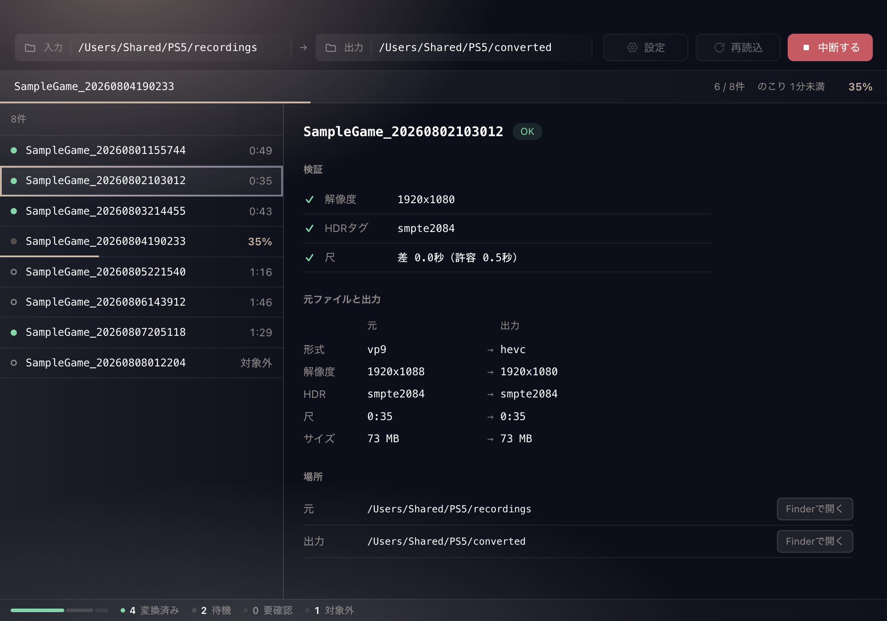

# ps5-converter

PS5の録画ファイル(webm)をMP4に変換するデスクトップアプリです。

## 必要なもの

- macOS (ハードウェアエンコードにVideoToolboxを使うため、動作対象はmacOSのみ)
- ffmpeg, ffprobe（要`brew install ffmpeg`）
- pnpm 11.8.0

## 対応状況

| PS5の設定                                | 録画の仕様                                                   | 対応 |
| ---------------------------------------- | ------------------------------------------------------------ | ---- |
| 効率を優先（WebM） / 1920x1080 / HDRあり | 1920x1088、VP9 10bit、BT.2020 PQ、フルレンジ、Opus 2ch 48kHz | ✅   |
| 効率を優先（WebM） / 3840x2160           | 3840x2160、他は同上                                          | ❌   |
| HDRなし                                  | BT.709のSDR                                                  | ❌   |
| 互換性を優先（MP4）                      | H.264のmp4                                                   | ➖   |
